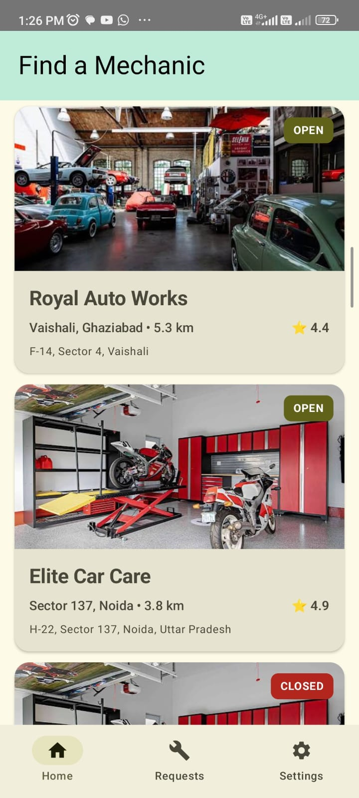
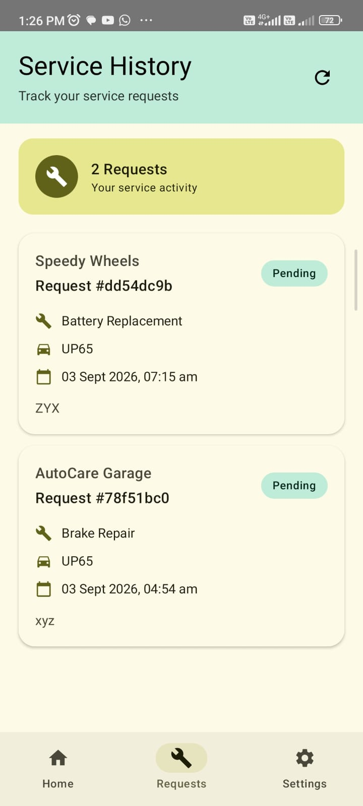
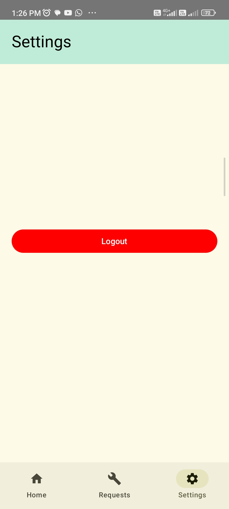
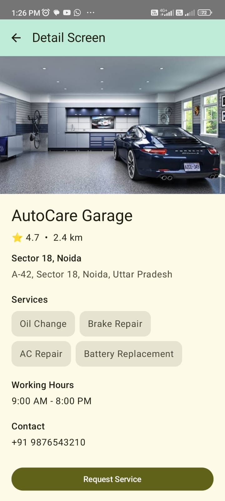
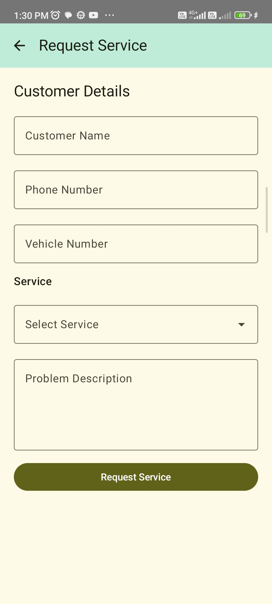
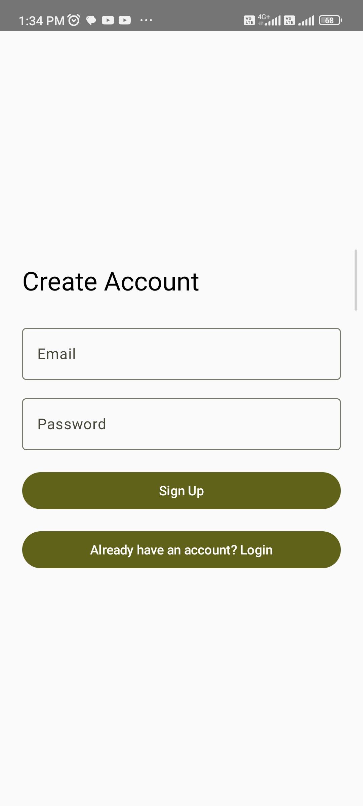
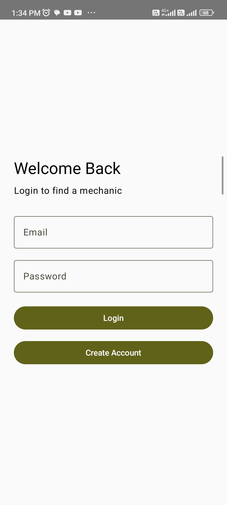

# 🔧 Mechanic Service

A modern Android app for finding mechanics, exploring their services, and requesting vehicle servicing.

## ✨ Features

- 🔐 Login & Signup with persistent sessions
- 🏠 Browse mechanics with rating, distance, location & availability
- 🔧 View mechanic details and available services
- 🛠️ Submit service requests
- 📋 View service request history & status
- ⚙️ Logout & session management
- ⚡ Loading, error & empty states

## 🛠️ Tech Stack

- Kotlin
- Jetpack Compose
- MVVM
- Retrofit
- Supabase REST API
- Kotlin Serialization
- Coroutines & StateFlow
- Material 3
- Coil

## 🏗️ Architecture

The app follows **MVVM architecture** with separation of UI, business logic, and data layers.

```text
UI (Jetpack Compose)
        ↓
    ViewModel
        ↓
    Repository
        ↓
     Retrofit
        ↓
     Supabase
```

## ☁️ Backend

The application uses **Supabase** for authentication, database, and REST APIs.

### Database Tables

```text
mechanics
services
mechanic_services
service_requests
```

### Data Model

- **mechanics** — Stores garage information, rating, location, distance, working hours, phone number and availability.
- **services** — Stores the services offered by mechanics.
- **mechanic_services** — Maps mechanics to the services they provide.
- **service_requests** — Stores customer service requests along with vehicle details, selected service and request status.

### API / Data Flow

The app communicates with Supabase using its REST API through Retrofit.

```text
Jetpack Compose UI
        ↓
    ViewModel
        ↓
    Repository
        ↓
     Retrofit
        ↓
 Supabase REST API
        ↓
   PostgreSQL DB
```

### API Endpoints

#### Authentication

```text
POST /auth/v1/token?grant_type=password
```

Used for user login with email and password.

```text
POST /auth/v1/signup
```

Used to create a new account.

#### Mechanics

```text
GET /rest/v1/mechanics
```

Fetches the list of available mechanics.

```text
GET /rest/v1/mechanics?id=eq.{mechanicId}
```

Fetches details of a specific mechanic.

#### Services

```text
GET /rest/v1/mechanic_services
```

Fetches the services associated with a mechanic.

The response uses Supabase's nested relationship:

```text
mechanic_services
        ↓
    services
        ↓
   service name
```

#### Service Requests

```text
POST /rest/v1/service_requests
```

Creates a new service request.

```text
GET /rest/v1/service_requests
```

Fetches the logged-in user's service request history.

The request history also retrieves related mechanic and service information:

```text
service_requests
      ├── mechanics → garage_name
      └── services  → service_name
```

### Authentication & Sessions

After successful login/signup, the app stores the Supabase access token, refresh token and user ID locally using `SharedPreferences`.

Authenticated requests send:

```text
Authorization: Bearer <access_token>
```

This allows service requests and service history to be associated with the currently logged-in user.

## 🚀 Setup

1. Clone the repository.
2. Open the project in Android Studio.
3. Create a `local.properties` file in the project root.
4. Add your Supabase credentials:

```properties
SUPABASE_URL=YOUR_SUPABASE_URL
SUPABASE_KEY=YOUR_SUPABASE_ANON_KEY
```

5. Sync Gradle and run the application.

## 🔒 Security

- Supabase credentials are stored in `local.properties`.
- `local.properties` is excluded from Git.
- Secret/service-role keys are never committed to the repository.
- Authenticated API requests use the user's Supabase access token.

## 📱 Screenshots


<p align="center">
  


  


  


  
</p>
<p align="center">
  


  


  
</p>
